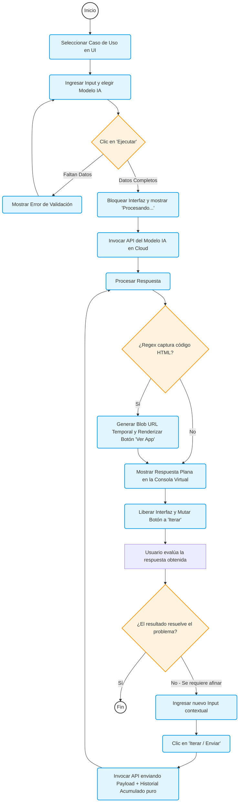

# Product Requirements Document & Manual Funcional - Prompt Manager v1.1.0

> *"El software exitoso se construye sobre la base de entender y resolver un problema real del usuario con la menor fricción posible."* — Inspirado en *Don't Make Me Think* (Steve Krug) y *User Story Mapping* (Jeff Patton).

Este documento funciona como fuente de verdad integral del producto, combinando las especificaciones funcionales, los modelos de negocio y las guías de usuario bajo marcos de trabajo ágiles de ingeniería de producto.

---

## 1. Visión y Propuesta de Valor (Value Proposition Design)

**Propósito del Producto:** Prompt Manager v1.1.0 es una plataforma centralizada (SPA) diseñada para Ingenieros de IA, Desarrolladores y Analistas de Negocio. Su objetivo es gobernar, iterar y ejecutar Casos de Uso (Prompts) contra múltiples LLMs (GPT-4o, Claude 3.5, Gemini) de manera controlada y sin fricción técnica.

*   **Customer Jobs (Tareas del Usuario):** Probar prompts, guardar plantillas recurrentes, compartir flujos de trabajo de IA, iterar instrucciones refinando respuestas previas.
*   **Pains (Dolores actuales):** Perder prompts exitosos atrapados en historiales de chat genéricos, necesidad de copiar y pegar reglas "System" una y otra vez, dificultad extrema de iterar frente a diferentes modelos (OpenAI vs Anthropic) sin cambiar permanentemente de herramienta web y contexto.
*   **Gains (Beneficios y Ganancias):** Ejecución estandarizada a "un clic", bóveda local infalible y estricta para API Keys, historial de chat por sesión que retiene el contexto subyacente de la IA iterada, y "zer0-setup" para proyectos web al autodesplegar aplicaciones extraídas directamente de las devoluciones del modelo cognitivo.

---

## 2. Glosario de Dominio (Ubiquitous Language)
Siguiendo los principios de **Domain-Driven Design (DDD)** (Evans), establecemos una terminología omnipresente para alinear completamente el entendimiento entre el Product Owner (PO), Diseño y el Equipo Técnico:

*   **Caso de Uso (Use Case):** Entidad lógica central. Es una plantilla ejecutable inmutable que almacena un Nombre, un conjunto de Reglas Generales (System Prompt) y pertenece a una Sección/Sub-sección.
*   **Input (Entrada):** La consulta conversacional de turno o variables particulares que el usuario dicta exclusivamente al momento de ejecutar un Caso de Uso.
*   **Sección (Section):** Agrupador o Carpeta de más alto nivel para los Casos de Uso (Ej: "Desarrollo", "Ventas").
*   **Sub-sección (Subsection):** Sub-agrupador semántico dentro de una Sección (Ej: "React", "Core API").
*   **Iteración (Chat Loop):** Acción explícita de responderle a un Output previo del modelo, empaquetando el actual Input junto con el arreglo histórico subyacente completo para inyección contextual.
*   **Bóveda Local (Local Vault):** Mecanismo de persistencia criptográficamente pasivo del navegador (`localStorage`) utilizado para aislar los secretos y API Keys de las nubes públicas.
*   **Proyecto Demo Local:** Objeto de atajo que registra parámetros amigables de una vista `index.html` estática generada, proporcionando enlaces hacia la ruta directa (URI) y código público GitHub.

---

## 3. Flujos de Negocio (User Flows - BPMN 2.0 Notation)

A continuación se modela el ciclo de vida general "**Ejecución e Iteración de un Caso de Uso**" usando notación BPMN algorítmica.



---

## 4. Historias de Usuario (Specification by Example - BDD Gherkin)

Alineados con *Specification by Example (Gojko Adzic)* y *Software Requirements (Karl Wiegers)*, documentamos Criterios de Aceptación (Acceptance Criteria) inequívocamente testeables por QA.

### Epic 1: Estructuración y Recuperación de Conocimiento

**US 1.1: Como** usuario organizado, **quiero** poder clasificar mis Casos de Uso en sub-secciones dentro del nivel de Sección **para** estructurar granularmente arquitecturas de proyectos extensas.
```gherkin
Feature: Categorización Dinámica Discreta de Casos de Uso
  
  Scenario: Creación transversal de Sección con Sub-secciones encapsuladas
    Given que el usuario está posicionado en el Dashboard
    When hace clic sobre el botón de acción secundaria "+ Añadir Sección"
    And rellena el campo mandatorio "Nombre de Sección" como "Operaciones"
    And completa el input opcional "Sub-secciones" ingresando el valor "Logística, Inventario"
    And activa el evento para guardar la sección
    Then la barra de navegación lateral renderizará inmediatamente una etiqueta "Operaciones"
    And, subsecuentemente, al crear un nuevo Caso de Uso seleccionando "Operaciones", un dropdown nuevo aparecerá desplegando exclusivamente "Logística" e "Inventario" como opciones de anidamiento secundario.
```

**US 1.2: Como** Prompt Engineer, **quiero** poder crear un nuevo Caso de Uso centralizado **para** preservar instrucciones del sistema que utilizo recurrentemente.
```gherkin
Feature: Creación Estandarizada de Caso de Uso
  
  Scenario: Creación de un prompt base con guardado global en la nube
    Given que el usuario hizo clic en el botón primario "+ Crear Caso de Uso"
    And el modal "Nuevo Caso de Uso" se encuentra visible en primer plano
    When el usuario ingresa "Traducción Técnica" en el campo "Nombre"
    And selecciona una Sección válida del dropdown obligatorio
    And rellena el campo "Reglas generales del prompt" con un contexto inicial
    And presiona el botón "Guardar"
    Then el sistema bloquea momentáneamente el botón previniendo duplicidades cruzadas (debouncing visual)
    And el servidor Cloud sincroniza exitosamente el nuevo registro
    And el modal se cierra desplegando un toast de éxito afirmando "Caso de Uso global guardado exitosamente"
    And la vista o sección actual se vuelve a renderizar incluyendo la nueva tarjeta descriptiva.
```

**US 1.3: Como** usuario administrador de mis templates, **quiero** poder editar las definiciones de un Caso de Uso existente **para** evolucionar el comportamiento del LLM en el tiempo sin tener que borrar y crear un registro nuevo.
```gherkin
Feature: Modificación Estructural de Caso de Uso
  
  Scenario: Edición de campos y re-asignación de subsección
    Given que un Caso de Uso activo se despliega en tarjetas o popups de ejecución
    When el usuario hace clic en el disparador interno ✏️ (botón de edición) referente al prompt
    Then se desplegará el modal mutante con el encabezado sobreescrito a "Editar Caso de Uso"
    And los input elements de Nombre, Reglas e Input estarán proactivamente llenos (pre-fill) con los datos guardados de ese Caso.
    And si el usuario modifica el contexto y le da a Guardar, el sistema muta el registro pre-existente sin alterar la primary key.
```

### Epic 2: Seguridad y Configuración de Infraestructura

**US 2.1: Como** individuo responsable de seguridad de datos, **quiero** ingresar tokens (API Keys) privativas **para** autorizar llamadas al modelo IA sin que mis llaves se suban, graben, o vulneren mediante la red de backend público de Prompt Manager.
```gherkin
Feature: Bóveda de Secretos en Local Storage (Client-Side Encryption)
  
  Scenario: Configuración de tokens hacia LLMs Cloud
    Given que el usuario abre el modal "Configuración de Integraciones" mediante el ícono de engranaje (⚙️)
    When el usuario tipea el string "sk-ant-test1234..." en el input de Anthropic API Key
    And oprime el botón mandatorio de acción "Guardar Keys Localmente"
    Then el modelo DOM intercepta el evento cancelando la redirección estándar (preventDefault)
    And ejecuta llamadas exclusivas a la API del navegador Window.localStorage.setItem() 
    And la clave ingresada nunca resulta transportada visiblemente por payloads de internet, persistiendo pasivamente hasta ser invocada en runtime.
```

### Epic 3: Motor de Ejecución Contextual Generativo

**US 3.1: Como** Ingeniero Prompt interrumpiendo un Workflow, **quiero** poder refutar o corregir las salidas del Modelo de Lenguaje sosteniendo en memoria la conversación y las respuestas anteriores **para** construir código o texto evolutivo y guiado orgánicamente.
```gherkin
Feature: Motor de Chat Loop y Memoria Contextual Subyacente
  
  Scenario: Iteración consecutiva infiriendo memoria a corto plazo
    Given que el Modal de Ejecución de un Caso de Uso se encuentra maximizado y enfocado
    And el cliente completó satisfactoriamente una ejecución (Run) inicial (Estado Turno Múltiple)
    When el nodo de texto de la respuesta de IA finaliza su inyección en la Terminal de DOM
    Then el botón primordial debe cambiar forzosamente su estado visible a "⚡ Iterar / Enviar"
    And se inyectará el atributo HTML 'disabled' en el selector origen de "Modelo IA" para impedir cruces de contexto entre proveedores
    And la porción de Output visual previa deberá comprimirse verticalmente usando nodos desplegables
    And cuando el usuario ingresa un nuevo texto y presiona "Iterar", este texto viaja encapsulado en el payload final anexando los roles pasados al mismo Request estructural.
```

### Epic 4: Estados y Asignaciones (Colaboración)

**US 4.1: Como** Project Manager, **quiero** asignar un estado de ciclo de vida a los casos de uso **para** saber rápidamente qué templates están aptos para usarse de forma productiva.
```gherkin
Feature: Ciclo de vida del Prompt
  
  Scenario: Cambio de estado reactivo en tarjeta
    Given que el usuario visualiza cards en la cuadrícula
    When selecciona el dropdown interactivo de "Estado" en la esquina superior de la tarjeta
    And cambia de "En construcción" a "Validado"
    Then el sistema actualiza el estilo de la etiqueta y guarda asíncronamente contra Firebase.
```

**US 4.2: Como** Lider, **quiero** asignar un usuario responsable a un prompt **para** distribuir la faena de testeo y pre-construcción.
```gherkin
Feature: Tagging de Asignación Personal
  
  Scenario: Modificación del avatar de asignación
    Given un prompt huérfano (sin nombre de asignado visualizado)
    When el usuario pulsa sobre el avatar de agregar humano (+) de la card
    And ingresa "Mariana" en el Modal que se asoma y pulsa "Guardar Asignación"
    Then el ícono circular pasará a mostrar textualmente "Mariana".
```

### Epic 5: Explorador Github Codebase

**US 5.1: Como** Full-stack Developer, **quiero** ver la estructura de código remotamente **para** no necesitar clonar ramas.
```gherkin
Feature: Repositorio UI (API Hub)
  
  Scenario: Visualizar jerarquías en Split-View
    Given que el developer interactúa con "Repositorio" en la vista lateral izquierda
    When el módulo carga en vivo
    Then el panel presentará a un costado el layout recursivo de carpetas de origin/main
    And a la derecha previsualizará (con soporte de Markdown) el contenido explícito con opción total de descarga raw hacia el disco.
```

---

## 5. Mapeo Funcional y Navegación Detallada (UI Guide)

Basado en la filosofía *"No me hagas pensar"* de Steve Krug. Qué ocurre cuando un usuario interactúa con la plataforma.

### 5.1 Barra Superior (Topbar) Global
*   ⚙️ **(Configurar Integraciones):** Abre el Panel de Bóveda Local. Dispone de campos ocultos tipo `password` para los tokens de AI Services. **Acción de botónera:** Sobreescribe instantáneamente cualquier par Value en el disco duro.
*   **+ Añadir Proyecto:** Registra Demos producidas localmente. Exige inputs mandatorios de título, path relativo/absoluto en el ordenador físico hacia el index HTML, y vínculo hacia su rama remota de Repositorio (ej: Github).
*   **+ Crear Caso de Uso:** Elemento Primario del sistema. Modela mediante formulario un Documento Firestore nuevo. Recolecta Nombre, dependencias forzosas (Sección target), directivas `System Prompt` como Reglas y salva centralmente.

### 5.2 Barra Lateral (Arquitectura de Navegación)
*   **Inicio:** (Home Dashboard). Elimina selectores activos y muestra la vista estática global.
*   **Lista de Secciones:** Items con `class="nav-item"`. Escuchan el click de rooteo dinámico. Disparan transiciones ocultando secciones disonantes y filtrando (`array.filter()`) el objeto en memoria global para reconstruir tarjetas concernientes a la sección.
*   **+ Añadir Sección:** Función administrativa baja. Inserta carpeta principal y sub-índices.
*   ✏️ **(Lápiz de Edición):** Despliega el Editor de Nodos Estructurales. Permite la refactorización de títulos de colecciones sin corromper Foreign Keys, ya que la correlación ocurre con identificadores no expuestos como UID `sec_timestamp`.

### 5.3 Dashboard General (Inicio de Entorno)
*   🚀 **Populares (Top 5):** Rejilla de priorización superior y calculada en vivo según metadata `executeCount`. Aporta descubribilidad en el equipo, realzando Casos vitales mediante un badge de "Ubicación" (ej: 📍 *Ventas*).
*   🛠 **Mis Proyectos:** Gráfico de Demos locales hibridados.
    *   *Botón `[🔗 Ver App]`*: Aprovecha el navegador para rutear a un Protocol File externo, ejecutando el Demo.
    *   *Botón `[GitHub]`*: Redirección de URL universal `_blank`.
    *   *Botón `[🗑️]`*: Destrucción en disco estricto de la representación visual referencial, no anula los archivos subyacentes.

### 5.4 Panel de Sección (El Workspace Dinámico)
*   **Agrupamiento Automático Inteligente:** Si entramos a "Desarrollo", veremos separadores semánticos `📂 Frontend`, delimitando limpiamente qué tarjetas le conciernen. Casos sin parentesco de subsección caen en fallback de "General".
*   *Tarjeta de Caso de Uso:* 
    *   **Click de Cuerpo / Click a `[⚡ Ejecutar]`:** Desaparece contexto circundante, levantando Z-Index Modal de Ejecución.
    *   **Botón `[📋 Copiar]`:** Traslada limpiamente el Título como header, seguido por las Reglas, directo al portapapeles universal del OS en crudo.
    *   **Botón `[🗑️ Borrar]`:** Activación de mecanismo destructivo Cloud Firestore, confirmación explícita solicitada, aniquilando iteraciones y template base permanentemente.

### 5.5 Modal de Ejecución Categórica ("El Playground")
*   **Campo "Reglas":** Exposición visual estricta y controlada `(readonly)` del corazón directivo del prompt. Presenta un sub-botón táctico de edición (pencil icon) que, si es impulsado, interrumpe el modal activo para ofrecer reescribir inmediatamente las reglas matrices subyacentes.
*   **Input Contextual (Requerido):** El área conversacional para variables (`[Ingresar Target Público]`).
*   **Target Selector de Modelos IA:** Orquestador de enrutamiento web-request. Determina la transformación del JSON Payload hacia Anthropic, OpenAI o el motor default Gemini (prioriza latencia / costo si no está seteado auto).
*   **Terminal de Ejecución (`#console-output`):**
    *   Exhibición sincrónica de logs sistémicos (Carga, Conexión OK/Failurada).
    *   **Zero-Setup Middleware Trigger (Aceleración Web):** Implementación subyacente de regex de alta velocidad; si visualiza la directiva \`\`\`html generada por el LLM, aborta la impresión monótona e interviene la interfase anexando un Blob Object URL Button. El desarrollador da clic, y la Web Application autogenerada arranca en entorno Sandbox.
*   **Botonera Dual (Commit y Chat):** Un solo Action Button primario, polimórfico en semántica para salvaguardar carga cognoscitiva: Es `Ejecutar` durante Estado Cero, deviniendo en `Iterar / Enviar` para todas las réplicas siguientes, comprimiendo inteligentemente los reportes preexistentes bajo un acordeón Disclosure Widget nativo.

---

## 6. Prototipado y Ecosistema de Diseño (Wireframes)

*   🔗 **Punto de Enlace Figma:** `<TBD: A la espera de integración de producto UX>`
*   **Sistemas de Diseño Acoplados:** Se insta a utilizar y referenciar las clases nativas del archivo `styles.css` del repositorio maestro, priorizando el patrón adaptativo `Grid CSS minmax` actual frente a requerir external frameworks monolíticos como Bootstrap o Tailwind con el fin de retener el formato *Zero-Bundle Pipeline*.

---
*Elaborado por la Célula de Producto (PO & Business Design) | Actualización Registrada: Marzo 2026. Documentación "Living Document". Versión 1.1.0*
